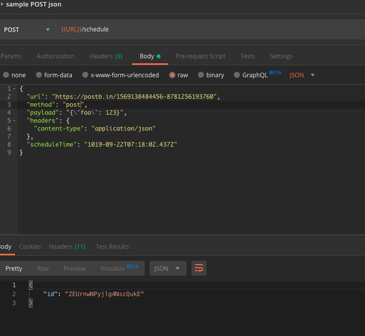
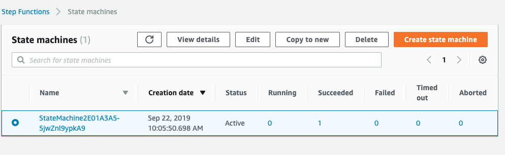
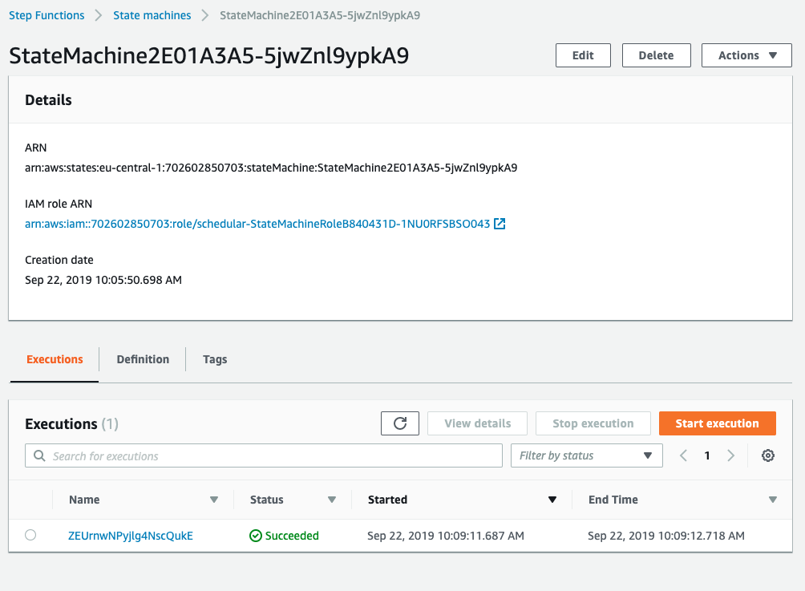
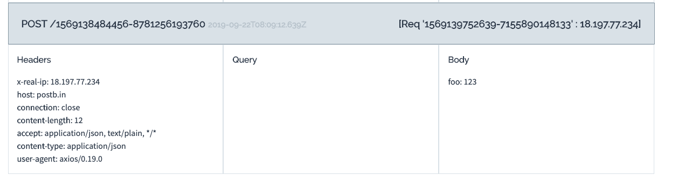
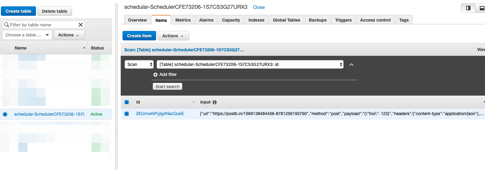
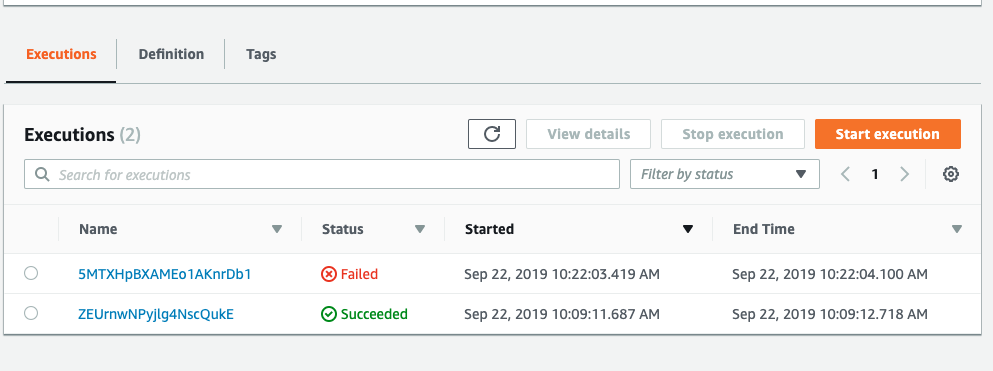
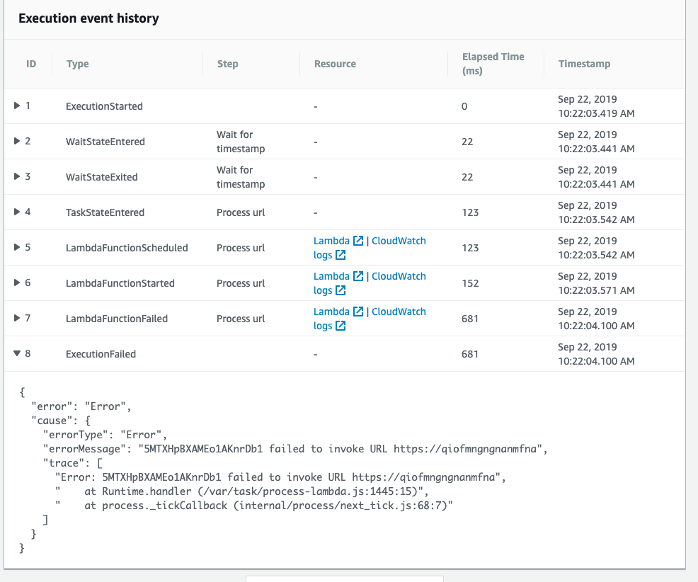
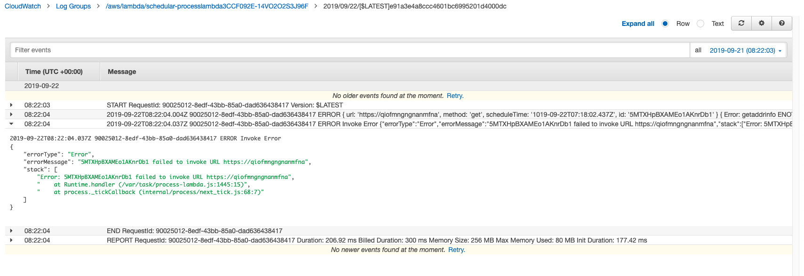

# AWS-Scheduler

## Requirements

- node v10
- cdk:
  - `npm i -g aws-cdk`
  - `cdk bootstrap`
- postman for testing https://www.getpostman.com/

## Deploy

```bash
yarn
yarn run build
cdk deploy
```

## Verification

`cdk deploy` should take 1-3 minutes.  
It will output url. Example:

```bash
scheduler.apiEndpoint9349E63C = https://lffp8olcqa.execute-api.eu-central-1.amazonaws.com/prod/
```

Load postman_collection and postman_environment from `postman` directory.  
Update `URL` in postman_environment using `scheduler.apiEndpointXXX` from above log.  

Go to https://postb.in/ and create a bin.  
Example: Use `https://postb.in/1569139847006-7755104615353` in postman endpoints.  

Call Sample endpoint



`id` in the response will be used as a `name` in step function and a  primary key in DynamoDB.

Open https://eu-central-1.console.aws.amazon.com/states/home (make sure to choose a proper region)


Click on the name


Step function is successful.  

Open bin from https://postb.in

You should see a request


Open https://eu-central-1.console.aws.amazon.com/dynamodb/home (make sure to choose a proper region)



A record is also inserted to db.

Invoke from postman `errors/url not found`  
HTTP request is successful, but step function should fail.



Click on the Name link from Failed item.


Scroll down to see the error details.  
You can also click on the CloudWatch link


### Notes

- Proper validation is implement for all input parameters.
- scheduleTime cannot be longer than 1 year.
- It's allowed to use past date for scheduleTime and it will execute immediately. It's better to omit validation because of network delays. For example: submit  a request with date "now +2 seconds", it can fail if there are e.g. network delays.
